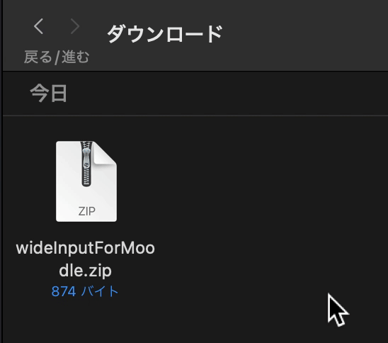

# Moodle拡張機能 wideInput

この拡張機能を利用すると、Moodleの**入力フィールドの横幅**が広がります。

自分の回答が見やすくなるので、見直しや共有に役立ちます。

## 導入前


## 導入後


# 導入方法

## 1. 拡張機能をダウンロード

[GitHubのRelease欄](https://github.com/hyouhyan/VC-Notice/releases/latest)から、**wideInputForMoodle.zip**をダウンロードします




ダウンロードが終わったらzipファイルをダブルクリックし、解凍しておきましょう

## 2. 拡張機能をインストール


Google Chromeを起動し、拡張機能管理ページを開く

以下のURLをコピペすると一瞬で開けます

```
chrome://extensions
```


**画面右上**の**デベロッパーモード**をオンにする 


**画面左上**にある**パッケージ化されていない拡張機能を読み込む**をクリック


予め解凍した**wideInputForMoodle**を選び、右下の**選択**を押す


拡張機能がChrome に読み込まれます

## 3. 横幅が広がる

Moodleの適当なコースの小テストページを開いてみましょう

全ての入力フィールドの横幅が広がっています

